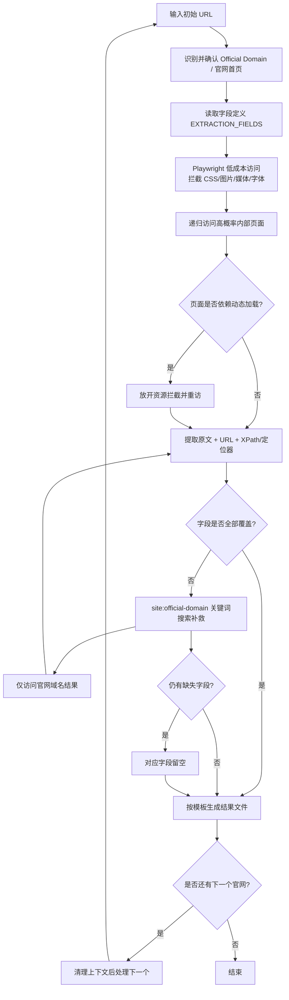

# 官网信息提取

从指定官网执行**原文信息提取**，并将结果以 Excel 扁平化视图进行保存。

## 核心工作流

1. **初始化**：读取 [EXTRACTION_FIELDS.md](references/EXTRACTION_FIELDS.md) 明确字段与提取逻辑。
2. **官网识别**：给定初始 URL 后，先识别并确认目标官网域名（Official Domain）与官网首页地址。
3. **首轮访问（低成本模式）**：使用 Playwright MCP 访问官网，优先拦截无关资源（`stylesheet`、`image`、`media`、`font`）以减少上下文和 token 消耗。
4. **递归寻址与页面发现（Level 1）**：
   - 若站点提供 `sitemap.xml` 或可访问的“网页指南/网站地图”页面，优先使用 sitemap 建立站内 URL 索引并按字段相关性排序。
   - 从首页导航、页脚、站点地图、About/Contact/IR/Leadership 等高相关入口开始。
   - 递归访问所有高概率内部页面，直到字段覆盖率不再提升。
   - 若发现页面内容依赖动态渲染（延迟加载、前端注入、交互后出现），可放开资源拦截并重新访问，优先保证信息完整提取。
5. **字段提取与证据记录**：
   - 对每个字段记录官网**原文**与披露 URL。
   - 优先记录精确 XPath；若页面为动态加载且 XPath 无法稳定获取，可将 XPath 留空，并改用可复核定位器（如 CSS 选择器、文本锚点、区块标题）进行追溯。
   - 优先建立“字段 -> 最佳来源页面”映射，再回填模板。
6. **搜索补救（Level 2，仅用于发现官网内部链接）**：
   - 对仍缺失字段，使用 `site:<official-domain> <关键词>` 的 Google 搜索补充官网内部页面线索。
   - 仅允许进入并提取目标官网域名下的页面；禁止从第三方域名提取数据。
7. **缺失字段留空**：经过官网路径分析与站内搜索补救后仍找不到的字段，提取文本与“XPath/定位器”保持留空（且无文本时 URL 也留空）。
8. **多官网批处理**：
   - 多个官网时逐个处理。
   - 每完成一个官网立即生成一个结果文件。
   - 处理下一个官网前，清理当前任务上下文（仅保留必要规则与模板）。
9. **输出结果与备注**：按模板输出，并在“提取备注与未解决困难”中记录关键障碍与边界判断。

## 操作流程图

## 输出与归档要求

- **存储路径**：`<工程根目录>/results/<YYYYMMDD>/homepage-info-extractor/`。
- **命名规范**：`<目标官网域名>.md`。
- **独立性**：一个官网一个文件。

## 资源参考

- **字段逻辑定义**：详见 [references/EXTRACTION_FIELDS.md](references/EXTRACTION_FIELDS.md)。
- **输出模板**：详见 [assets/templates/template-table.md](assets/templates/template-table.md)。
